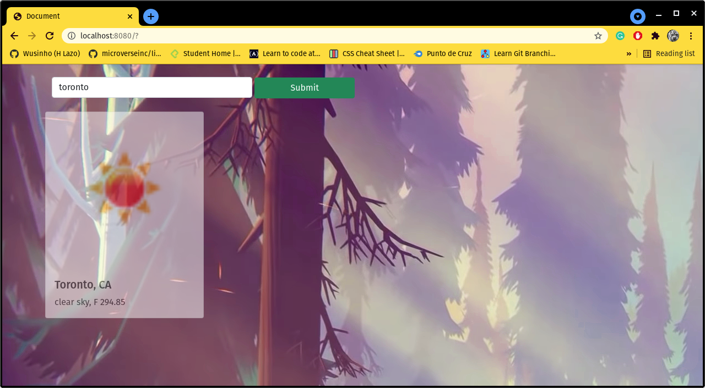

# Todo-List

## About

This project is a weather app using OpenWeather API to display the temperature and conditions of the desired city.

## Live View

<!-- [Live View](https://lazo-todolist.netlify.app/) -->

## Built with

- HTML
- Bootstrap
- JavaScript
- Webpack
- Package.json
- Openweathermap Api

## Getting started

### Prerequisites

- Text editor (strongly recommended VS Code)
- Empty directory where the repo is to be cloned

### To get a local copy of this repo

Run the following comands in the terminal in the next order:

- Step 1:  
  $ cd "here comes the path of your selected directory (double quotes must not be here)"

- Step 2:
  $ git clone https://github.com/Wusinho/Project-Weather-App/tree/Dev-feature

### To run this project in your local environment

- Step 1:
  npm install

- Step 2:
  npm run start

## Authors

👤 **Heber Lazo**

- Github: [@Wusinho](https://github.com/Wusinho)
- LinkedIn: [Heber Lazo](https://www.linkedin.com/in/heber-lazo-benza-523266133/)

## 🤝 Contributing

Contributions, issues and feature requests are welcome!

Feel free to check the [issues page](https://github.com/Wusinho/Project-Weather-App/issues).

## Acknowledgments

- Openweathermap Api
- Microverse
- Anyone whose detailed code inspired the creation of this project.

## 📝 License

This project is [MIT](LICENSE) licensed.

\*\*
Give a ⭐️ if you like this project!

## Acknowledgments

- Microverse
- The Odin Project
- Anyone whose detailed code inspired the creation of this project.
